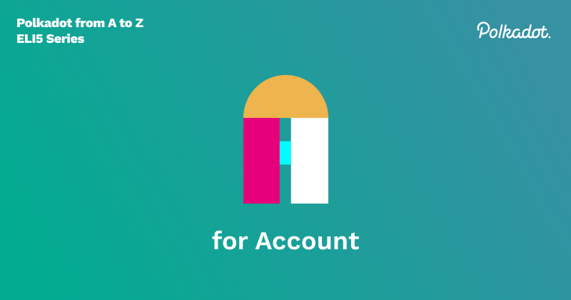

## What is an account?

Accounts are also sometimes referred to as wallets or addresses. On blockchains, we need a place to hold our assets, and this is what accounts are used for. A user can have many accounts. On Polkadot and Kusama, unlike most other public blockchains, we can even give accounts on-chain, authenticated, and human-readable identities if we would like to. 

## What a Polkadot account public key looks like
    14dQ7nC8YabzseZ5iqvG4EQnrkTCsUCwMbCP6nQWeKgjF6Ye

Accounts on Polkadot and Kusama are SS58-encoded key-network pairs. By representing an address as a combination of keys and network IDs, it makes sending assets to an address that is unusable much less likely (Ethereum only uses keys; imagine sending ETH from Ethereum mainnet to an account that only exists on Binance Smart Chain, which is another EVM-based chain and being confused as to why you can’t see the ETH on Binance Smart Chain). SS58 is a slight modification of the Bitcoin Base-58-Check encoding. By using different address prefixes, we can easily tell if an account is on the same chain as another. For example, Polkadot addresses start with a 1, Kusama is always with a capital letter, generic substrate addresses will start with a 5. 

## Creating an account

Like any blockchain address, Polkadot and Kusama accounts are controlled with public-private key pairs. This is a cryptographic way of creating a public-facing id that is intrinsically linked to a private id, which should be kept secret. The address generation starts with a mnemonic phrase which is then converted into a public-private key pair. Because different wallets use different ways to derive the public and private keys from the mnemonic phrase, there can be issues with deriving the same public and private key pairs from the same mnemonic on different wallets.

## What a mnemonic phrase looks like

    way pumpkin card castle crystal domain mystery chalk dog twin chronic image

## Portability

 Accounts can also be utilized across Substrate chains. Since addresses are the result of encoding a public key and a network ID, we can create an address for another chain by decoding the address, changing the network ID, and encoding the key with the new network ID, resulting in a new address that is controlled by the same underlying key. This allows you to use one mnemonic phrase across multiple Substrate chains.