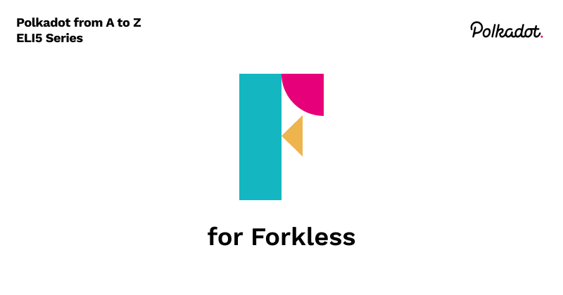

## Forking

A fork is when a codebase is copied and developed separately from the original version. With open source software, this is legal, though forks can happen in licensed software as well, both legally and illegally. In the realm of blockchain and cryptocurrency projects, forks happen frequently, meaning not only do new copies of the codebase get created and developed as separate projects, but sometimes even certain updates on the same code base require forks. 
Traditional blockchains like Bitcoin and Ethereum require forks because of their architecture. Bitcoin has been forked thousands of times, and has hundreds of forks that became legitimate blockchain projects, each copy has been developed differently from the original. For example, Bitcoin Cash was a fork of Bitcoin, and so was Bitcoin Gold. But also some not so obvious forks include Ethereum and Litecoin. And sometimes there are levels, for example DogeCoin was a fork of Lucky Coin, which was a Fork of Litecoin, which is a fork of Bitcoin.

## Runtime

Runtime is the environment in which a piece of software gets executed. This includes the hardware requirements and software changes. An upgrade in runtime is indicated by a change in the version, ie. 1.0.0 to 2.0.0

## Hard Fork

A hard fork can be two things, a software upgrade to a network, or a split in the network. It is when clients on the network will need to upgrade or switch over to the new version or else it will be incompatible with the new runtime.

## Soft fork

A soft fork is a backward compatible upgrade. The clients on the network will not need to upgrade to a newer version in order to keep working. 

## Forkless

Substrate-based chains are able to upload the runtime bytecode as a Wasm(WebAssembly, which we will talk about when we get to letter W) blob. This is done through Polkadots on-chain governance system. If a new runtime is successfully voted on, and the network agrees to the upgrade, the next block will include the runtime upgrade. The participants on the network will then get the newest runtime and henceforth start building blocks with the new version. Forkless upgrades

## Further reading
- https://wiki.polkadot.network/docs/learn-runtime-upgrades&sa=D&source=editors&ust=1628347324659000&usg=AOvVaw0nEApwum2xo4s3Ggr9rVcp

- https://wiki.polkadot.network/docs/learn-wasm
