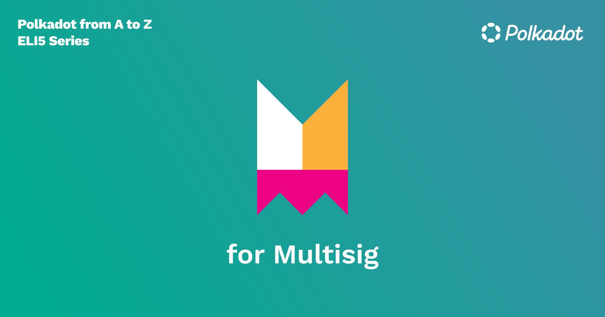

To have true ownership of your assets on the blockchain, we use accounts, and these accounts have addresses. An account is managed with keys: a public key with corresponding private key. Ownership of an account can be verified by the ability to prove you have the private key, which allows you to sign transactions. Without the private key, accounts on the blockchain are not usable. Losing your private key is equivalent to losing your wallet forever. 

Sometimes we need multiple accounts to sign off on transactions; think shared bank accounts or the government passing a bill requiring a certain amount of signatories. This is where multi-signature accounts come in. A multisig can comprise two or more accounts, and a signature **threshold** needs to be defined. This value equals or is less than the number of accounts part of the multisig. The threshold is the number of signatures required to sign the transactions on the multisig to execute the transaction. Multisig accounts can execute any on-chain function that a regular account can, including staking, governance, and simple transfers. However, you should exercise caution when using a multisig for staking or crowdloans, which are time-sensitive.

**Kind of cool**

You can determine a multisig account address even if it hasn’t been generated. All you have to do is know the accounts part of the multisig and the threshold number. Using these inputs, we can determine the multisig address. An interesting byproduct is that you can send a transaction to a non-existent address. If the accounts you chose to be the participants of that address were to create the multisig sometime in the future, they could access the transaction.

For example, here, I will take the Kusama stash addresses of Binance and Kraken and set a threshold of 2. This will generate the multisig address of those two accounts, with a threshold of 2. If I choose to, I can send KSM to that multisig, and if Binance and Kraken teams want to access that KSM, they would have to work together to set up the multisig.


```
--------------------------------
Addresses: E7ncQKp4xayUoUdpraxBjT7NzLoayLJA4TuPcKKboBkJ5GH F4xQKRUagnSGjFqafyhajLs94e7Vvzvr8ebwYJceKpr8R7T
Threshold: 2
Multisig Address (SS58: 0): 15XPbLctpFzEwA9qZgvYbsfEwPaBN9KVe7MFQao6bEur8sfX
--------------------------------
```
**Some use cases**

1. Two accounts can be used as two-factor authentication(2FA) for a larger stash account. And even 3FA, or if you choose 4FA, is possible; you can create as many
2. You can gather some friends, create a DAO or a corporation, and use a multisig account that holds the funds for the entity. When there is a transaction, all or most participants must sign off on it.
3. Multiple accounts can join forces to run for a seat on a Council.

**Be careful!**

A couple of things to be aware of; once a multisig is created, it cannot be altered! And, if someone were to lose access to their account, which is a part of the multisig, the multisig could be unusable, which would be very bad. In addition, a multi-sig, once created, needs to have an existential deposit to be usable. Substrate allows runtime developers to set a fixed amount of maximum accounts that can be a part of a multisig; in the case of Polkadot, this number is 100, and on other Substrate chains, this value might be different.

**Learn more and create a multisig…**

Check out [this](https://youtu.be/ZJLqszvhMyM?list=PLOyWqupZ-WGuAuS00rK-pebTMAOxW41W8&t=236) video by our Tech Ed team to learn how to create and use a multi-sig. Also, check out our [Wiki page](https://wiki.polkadot.network/docs/learn-accounts#multi-signature-accounts) for a slightly more technical and deep dive into how multi-sigs work.
